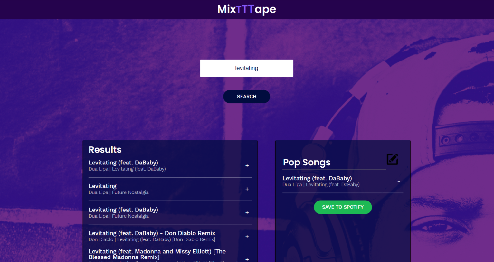

# MixTape
React web application made using components, passing state, and requests with the Spotify API to build a website that allows users to search the Spotify library, create a custom playlist, then save it to their Spotify account. It prortizes responsive design to allow quick access from a varitey of designs.

This program is a playlist builder built and designed to work with Spotify. With that in mind, you should have a Spotify account before you try to use this app.

Website live at: http://mixtttape.surge.sh/

### `npm install`

Installs the required modules. You can start application after entering your api key in Spotify.js

### `npm start`

Runs the app in the development mode. 
Open [http://localhost:3000](http://localhost:3000) to view it in the browser.

The page will reload if you make edits. 
You will also see any lint errors in the console.
